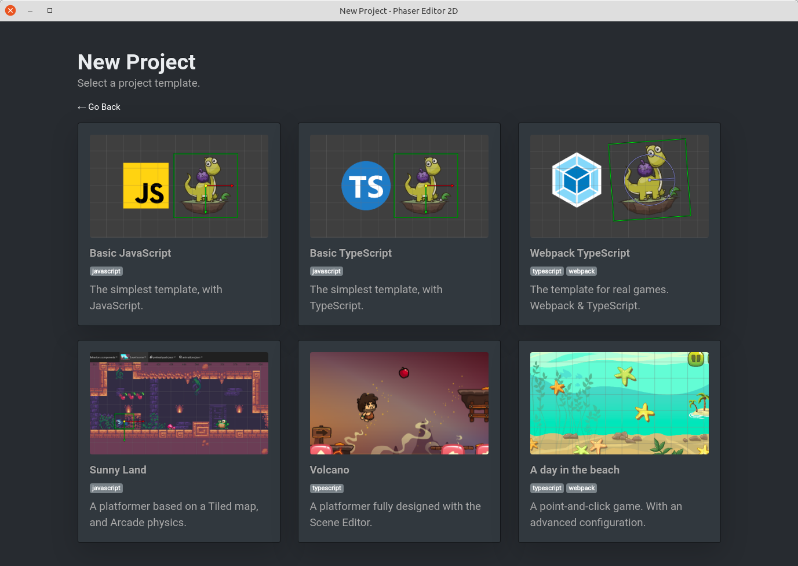

# Phaser Editor 2D v3 All-in-One edition



The All-in-One edition of Phaser Editor 2D.

* It wraps Phaser Editor 2D Core in an ElectronJS app.
* Provides better integration with the operating system (create, open projects).
* Provides project templates and demo projects.

## Run

1. Install dependencies:

```
npm install
```

2. Copy the latest Phaser Editor 2D server to the `server/` folder. The ElectronJS app will execute the `server/PhaserEditor2D` file.

3. Run the application:

```
npm start
```


